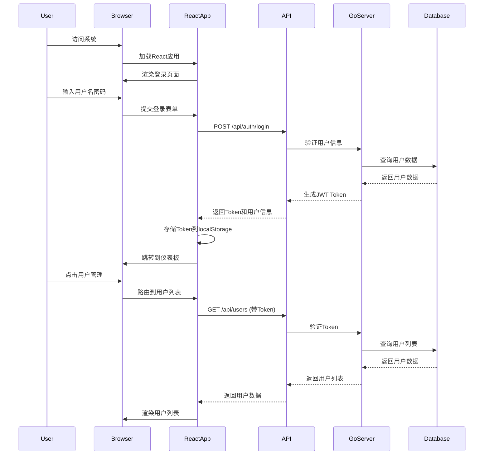

# 架构设计文档

## 概述
- 系统定位：基于 React + Vite + Ant Design 的前端用户管理系统，配合 Go + Gin + GORM 的后端API服务，提供完整的用户、角色、权限管理功能。
- 主要能力：
  - 用户认证与授权管理（JWT）
  - 用户CRUD操作与状态管理
  - 角色权限管理
  - 响应式管理界面
  - RESTful API设计
  - 数据持久化（SQLite）

## 技术架构图

```mermaid
flowchart TB
    subgraph Frontend
        R[React 18]
        V[Vite]
        AD[Ant Design]
        RR[React Router]
        AX[Axios]
    end

    subgraph Backend
        G[Go 1.21]
        GI[Gin Framework]
        GR[GORM]
        JWT[JWT Auth]
        COR[CORS]
    end

    subgraph Database
        SQL[(SQLite)]
    end

    subgraph External
        ICON[@ant-design/icons]
        DAY[dayjs]
    end

    R --> V
    R --> AD
    R --> RR
    R --> AX
    
    AX -.HTTP.-> GI
    GI --> JWT
    GI --> COR
    GI --> GR
    GR --> SQL
    
    AD --> ICON
    R --> DAY
```

## 系统架构图



## 前端架构

### 技术选型
- **React 18**: 现代化前端框架，支持Hooks和并发特性
- **Vite**: 快速的构建工具，支持热更新
- **Ant Design**: 企业级UI组件库
- **React Router**: 客户端路由管理
- **Axios**: HTTP客户端
- **@ant-design/icons**: Ant Design图标库
- **dayjs**: 日期处理库

### 目录结构
```
src/
├── api/          # API接口封装
├── components/   # 公共组件
├── context/      # React上下文
├── layouts/      # 布局组件
├── pages/        # 页面组件
├── router/       # 路由配置
├── utils/        # 工具函数
└── App.jsx       # 根组件
```

### 状态管理
- 使用React Context进行全局状态管理
- 使用useState和useEffect进行组件状态管理
- 使用localStorage存储用户认证信息

## 后端架构

### 技术选型
- **Go 1.21**: 高性能后端语言
- **Gin Framework**: 轻量级Web框架
- **GORM**: ORM框架，支持SQLite
- **JWT**: JSON Web Token认证
- **golang-jwt/jwt**: JWT库
- **gin-contrib/cors**: CORS中间件

### 目录结构
```
backend/
├── api/          # API控制器
├── config/       # 配置管理
├── middleware/   # 中间件
├── models/       # 数据模型
├── services/     # 业务逻辑
├── utils/        # 工具函数
└── main.go       # 入口文件
```

### 数据模型
- **User**: 用户实体
- **Role**: 角色实体
- **Permission**: 权限实体
- **UserRole**: 用户角色关联

## 数据库设计

### 用户表 (users)
```sql
CREATE TABLE users (
    id INTEGER PRIMARY KEY AUTOINCREMENT,
    username VARCHAR(50) UNIQUE NOT NULL,
    email VARCHAR(100) UNIQUE NOT NULL,
    password VARCHAR(255) NOT NULL,
    role VARCHAR(20) DEFAULT 'user',
    status VARCHAR(20) DEFAULT 'active',
    created_at DATETIME DEFAULT CURRENT_TIMESTAMP,
    updated_at DATETIME DEFAULT CURRENT_TIMESTAMP
);
```

### 角色表 (roles)
```sql
CREATE TABLE roles (
    id INTEGER PRIMARY KEY AUTOINCREMENT,
    name VARCHAR(50) UNIQUE NOT NULL,
    description TEXT,
    permissions TEXT, -- JSON格式存储权限列表
    created_at DATETIME DEFAULT CURRENT_TIMESTAMP,
    updated_at DATETIME DEFAULT CURRENT_TIMESTAMP
);
```

## 安全设计

### 认证机制
- 使用JWT Token进行用户认证
- Token有效期为24小时
- 支持Token刷新机制

### 授权机制
- 基于角色的访问控制（RBAC）
- 支持权限粒度控制
- 接口级别的权限验证

### 安全措施
- 密码使用bcrypt加密存储
- CORS跨域保护
- 输入参数验证
- SQL注入防护

## 性能优化

### 前端优化
- 组件懒加载
- 代码分割
- 图片优化
- 缓存策略

### 后端优化
- 数据库连接池
- 查询优化
- 响应缓存
- 并发处理

## 部署架构

### 开发环境
- 前端：Vite开发服务器（端口5173）
- 后端：Go开发服务器（端口8000）
- 数据库：SQLite文件数据库

### 生产环境
- 前端：静态文件部署
- 后端：Go二进制部署
- 数据库：SQLite或MySQL
- 反向代理：Nginx

## 监控与日志

### 前端监控
- 控制台错误日志
- 性能监控
- 用户行为追踪

### 后端监控
- 请求日志
- 错误日志
- 性能指标
- 数据库查询日志

## 扩展性设计

### 前端扩展
- 模块化组件设计
- 插件化架构
- 主题定制支持

### 后端扩展
- 微服务架构支持
- 数据库迁移支持
- 缓存层集成
- 消息队列集成

## 关联文档
- API规范：参见《[api_specification.md](./api_specification.md)》
- 部署说明：参见《[deployment_guide.md](./deployment_guide.md)》